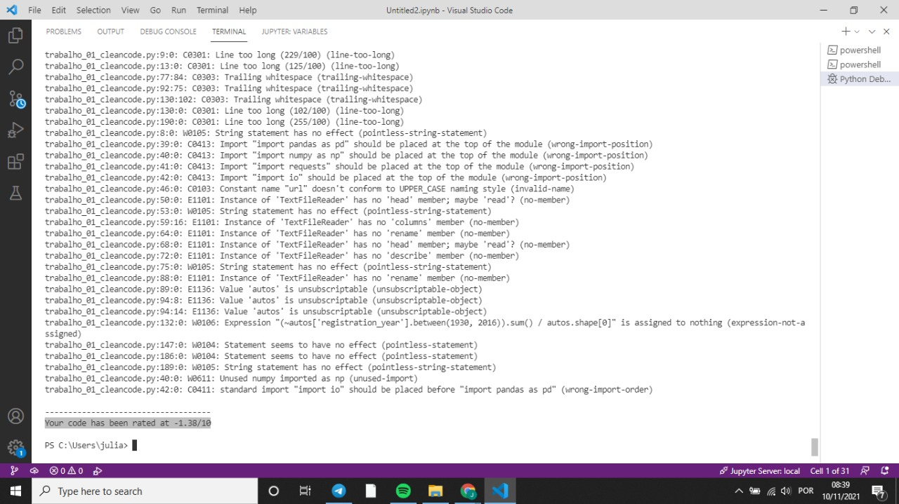

# Princípios de código limpo para Data Science e aprendizado de máquina
Autores:
Júlia Guardiani
Víctor Kaillo

Data:
Nov. 2021

Dsiciplimna: PROJETO DE SISTEMAS BASEADOS EM APRENDIZADO DE MÁQUINA - T01

Professor: Ivanovitch Medeiros Dantas da Silva

# Solução para o projeto guiado: [Exploring eBay Car Sales Data](https://app.dataquest.io/c/54/m/294/guided-project%3A-exploring-ebay-car-sales-data/)
O arquivo  contém um Jupyter Notebook que é nossa implementação do projeto guiado. Trabalhando com um conjunto de dados de carros usados do eBay Kleinanzeigen, uma seção de classificados do site alemão do eBay. O conjunto de dados foi originalmente alterado e carregado no Kaggle pelo usuário orgesleka. O conjunto de dados original não está mais disponível no Kaggle, mas você pode encontrá-lo em [Data Society: used cars data](https://data.world/data-society/used-cars-data). O objetivo deste projeto é limpar os dados e analisar as listagens de carros usados incluídas. Nesse ínterim, familiarizamo-nos com alguns dos benefícios exclusivos que o notebook jupyter oferece para pandas.

# Código limpo com pylint
Seguindo o estilo recomendado pelo PEP 8, o pylint verifica bugs e otimiza a qualidade do código fonte para a linguagem de programação Python. Ao utilizar a ferramenta, não obtemos o retorno do código analisado, mas uma verificação de erros segundo as recomendações de estilo e uma nota gerada automaticamente segundo os nossos erros no listo. A imagem a seguir apresenta a primeira execução do nosso código pelo pylint, com nota negativa de -1.38. 
Fazendo o que se pede pelo pylint conseguimos melhorar para a média aceitável.

Em alguma linhas, quando usávamos o ".head()" ou o próprio data frame para selecionar uma coluna específica, o pylint não reconheçou a nossa correção gerando um erro de " Value 'autos' is unsubscriptable (unsubscriptable-object)". Após conferir em algumas documentações vimos que era uma falha de reconhecimento. Por isso, desativamos a ferramenta pylint em algumas linhas de código.

O código a seguir é um comentário para cancelar alguma linha da correção específica:
""" #pylint: disable=E1101 """
